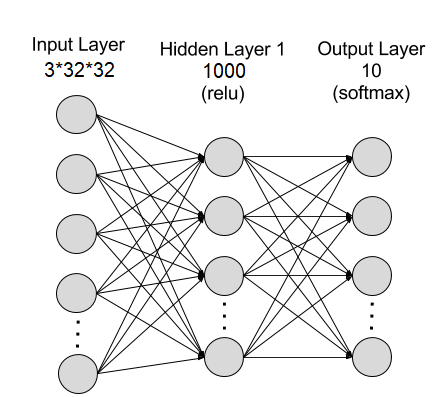
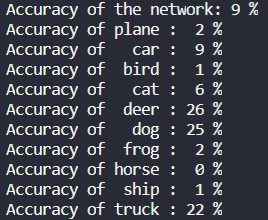

# CrashCourse PyTorch Lab
NOTICE: Much of the code was derived from the "Training a Classifier" article from PyTorch's official documentation, located at [https://pytorch.org/tutorials/beginner/blitz/cifar10_tutorial.html#sphx-glr-beginner-blitz-cifar10-tutorial-py](https://pytorch.org/tutorials/beginner/blitz/cifar10_tutorial.html#sphx-glr-beginner-blitz-cifar10-tutorial-py). The code was modified slightly for the purposes of this lab.

You will be making your very own neural network to classify images from the CIFAR10 dataset, which consists of thousands of images categorized into 10 different classes, given below.


## Prerequisites

Much of the instructions from this lab will assume you are working in a Linux environment, though you are free to use what environment you're familiar with. If you need a Linux environment, you can make use of the Timeshare UNIX machines offered by CMU (instructions to access [here](https://www.cmu.edu/computing/services/endpoint/software/how-to/timeshare-unix.html)).

Install PyTorch using the following Linux command:
```
pip install torch torchvision
```

If you are using a different environment that isn't Linux (or wish to install it via another method besides pip, such as Anaconda), then you can see specific instructions for your environment at: [https://www.cmu.edu/computing/services/endpoint/software/how-to/timeshare-unix.html](https://www.cmu.edu/computing/services/endpoint/software/how-to/timeshare-unix.html).

Then, clone this repository by running:
```
git clone git@github.com:keiffer01/CrashCourse-PyTorch-Lab.git
```

You will now have access to all the files you will need! The two files that you will be editing are `net.py` and `train.py`.

## Create your neural network in net.py
Open up the `net.py` file, where you will implement your neural network. You will have complete freedom to implement the network however you want. If you have trouble, don't be afraid to look back at the slides or ask any one of us for help! Some helpful hints have been given in the comments as well.

As a starting point, try creating the following neural network:



In other words, an Artificial Neural Network with a single hidden layer of size 1000 with a ReLU activation function. Remember to reshape the input using `x.view(-1, 3*32*32)`!

## Train your network using train.py

You can use the provided `train.py` file to train your network. At the top of the file are some hyperparameter that you are encouraged to play around with. They are:
- num_epoch: Number of times to repeat the training loop.
- batch_size: How many images to feed into the network at a time. Lower is more accurate, but much slower to train. Should not exceed 50000! (the size of the image set)
- learning_rate: How quickly you want the network to attempt to converge. Smaller values are more accurate but much slower, while higher values can actually make the network perform worse over time. Try to find a happy medium.
- net_name: The name of the file that will store the neural net when training completes.

You can also leave the parameters at their default values and see how it runs. To run the file, run the following command:
```
python3 train.py
```

Watch your network (slowly) learn!

## Test your trained network using test.py

You can use the provided `test.py` file to test how accurately your network performs. Run the following command to get a summary of statistics (it may take a few seconds):
```
python3 test.py
```

An example neural network, called "bad_net", was trained on this dataset with the following accuracy statistics:



Can you get your neural network to perform better??
